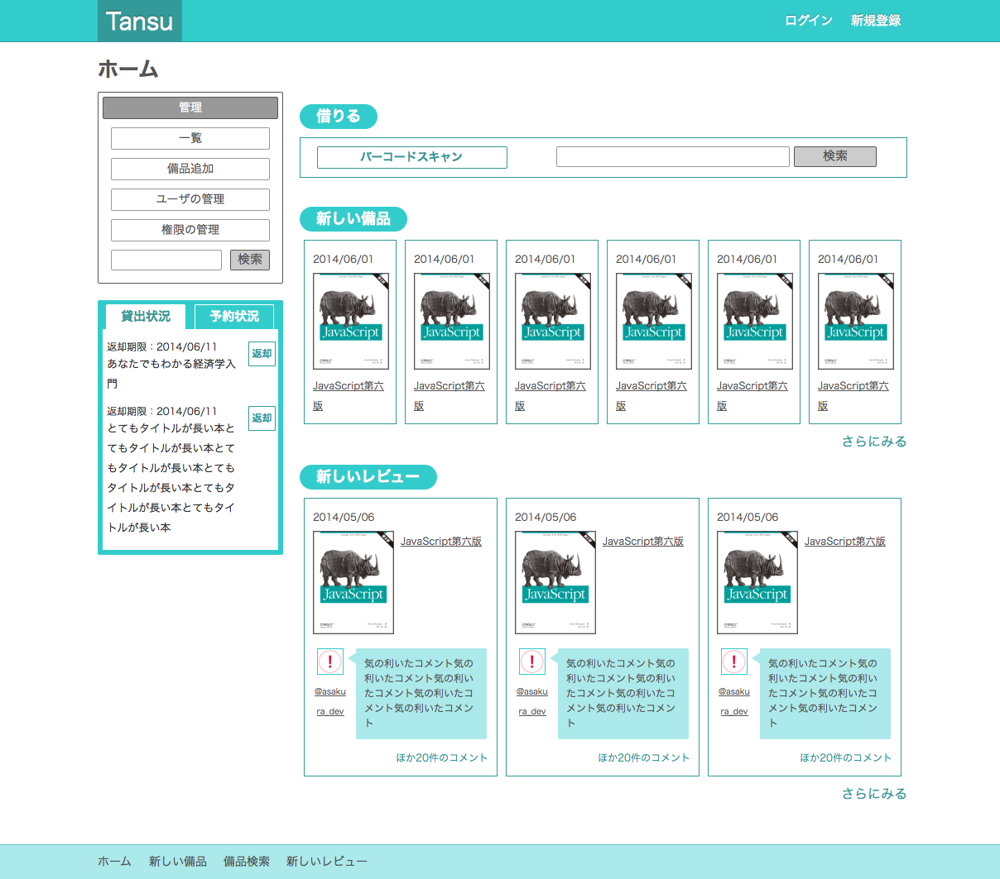

# Tansu


備品管理サービス
## インストール
[Ruby - rbenv インストールから Bundler を使用した Rails のローカルインストールと起動まで - Qiita](http://qiita.com/egopro/items/aba12261c053eecd6d19)  
を参考に，
- rbenv
- ruby
- bundler
- Ruby on Rails
をインストール

## 設定
config/application.sample.ymlをコピーして，config/application.ymlを作成し内容を変更します．
### メール周り
```yml
SMTP_ADDRESS: "smtp.example.com"
SMTP_PORT: 587
SMTP_USER_NAME: "username"
SMTP_PASSWORD: "password"
DEVISE_MAILER_SENDER: "username@example.com"
MAILER_URL_HOST: "yourhostname:portnumber"
```
メールの送信に必要な情報を設定してください．

### Twitterログイン
```yml
TWITTER_CONSUMER_KEY: ""
TWITTER_CONSUMER_SECRET: ""
```
[Twitter Application Management](https://apps.twitter.com/)よりアプリを作成し，各キーを取得して設定してください．  
アプリ作成の際のCallback URLは "http://あなたのホスト名/users/auth/twitter/callback"にしてください．

### Githubログイン
```yml
GITHUB_CONSUMER_KEY: ""
GITHUB_CONSUMER_SECRET: ""
GITHUB_CALLBACK: "http://yourhostname:portnumber/users/auth/github/callback"
```
[Authorized applications](https://github.com/settings/applications)より，アプリを作成し，各キーを取得して設定してください．  
アプリ作成の際のCallback URLは "http://あなたのホスト名/users/auth/github/callback"にしてください。  

### Yahooショッピングの商品検索APIの設定
```yml
YAHOO_APPLICATION_ID: ""
```
[Yahoo!デベロッパーネットワーク](http://developer.yahoo.co.jp/)より，アプリを作成し，アプリケーションIDを取得して設定してください．

## はじめてのログイン
新規登録よりアカウントを作成し、ログインしてください。  
最初に有効化されたアカウントがサービス開始時の"オーナー"になります。  
2人目以降のユーザーは、"オーナー"または"管理者"権限を持つユーザの承認を経て、Tansu内のサービスを利用することができるようになります。
